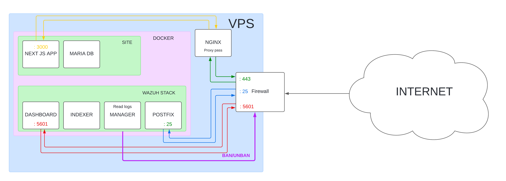

# SOMMAIRE
1. [Introduction](#introduction)
2. [Schema de l'infrastructure](#schema-de-linfrastructure)
3. [Description, installation, mise en place et documentation fonctionnelle](#description-installation-mise-en-place-et-documentation-fonctionnelle)
4. [Zoom sur le hardening et les configurations](#zoom-sur-le-hardening-et-les-configurations)
5. [Problèmes rencontrés](#problèmes-rencontrés)
6. [Axes d'amélioration](#axes-damélioration)
7. [Conclusion](#conclusion)
8. [Annexes](#annexes)


# Introduction

Voici le projet fil rouge du labo SSI de l'année scolaire 2023/2024 réalisé par Axel BROQUAIRE et Hugo ANDRIAMAMPIANINA. Il s'agit de coder un site internet classique où les utilisateurs peuvent se connecter/s'inscrire, puis laisser un message aux administrateurs grâce à un formulaire de contact. Les administrateurs peuvent ensuite se connecter à leurs propres comptes pour visionner les messages et l'image qui y est potentiellement jointe.

Au-delà de la simple fonctionnalité du site, une attention particulière a été portée à la sécurité de l'infrastructure qui héberge le site. Un système de monitoring de sécurité (Wazuh) avec des alertes par mail pour la gestion des événements et Suricata pour la détection d'intrusions réseau, ont été mis en place pour garantir la surveillance constante de l'environnement. De plus, des mesures de durcissement de configuration et de l'host ont été implémentées afin de renforcer la résilience face aux menaces potentielles.

## Specs
- OS : Ubuntu 22.04
- 4Go RAM
- 4 cores CPU


# Schema de l'infrastructure



Ce schéma représente l'infrastructure de notre projet, toutes les connexions réseau passent initialement par un pare-feu centralisé qui agit comme une première ligne de défense en filtrant le trafic entrant et sortant. 

Les utilisateurs normaux accèdent au site internet à travers le port 443 (HTTPS), assurant ainsi une communication chiffrée. Le trafic utilisateur est d'abord dirigé vers le pare-feu avant d'être transmis à NGINX. NGINX agit comme un reverse proxy, redirigeant ensuite les requêtes vers le conteneur Docker hébergeant le site web. Ce conteneur communique avec sa base de données au besoin et renvoie les réponses à NGINX, qui agit en tant qu'intermédiaire entre le programme et l'utilisateur final.

Les administrateurs accèdent au dashboard de Wazuh en se connectant directement au port 5601. Wazuh collecte des logs à partir de diverses sources, les analyse pour détecter d'éventuelles violations de sécurité et génère des alertes qui sont visualisées sur le dashboard de Wazuh. En cas d'alerte atteignant un niveau défini dans la configuration (dans notre cas, niveau 12), Wazuh déclenche l'envoi d'un e-mail d'alerte via Postfix. Wazuh supporte nativement l'envoi d'e-mail mais ne supporte aucun serveur smtp, j'ai donc ajouté postfix dans le docker compose de Wazuh pour permettre un envoie simple des e-mails tout en conteneurisant le serveur smtp.

Wazuh dispose également d'une fonctionnalité d'active-response, permettant la mise en œuvre de mesures correctives automatisées. Par exemple, en cas de détection d'une attaque de brute-force, Wazuh peut déclencher un bannissement temporaire pour l'adresse IP source.


# Description, installation, mise en place et documentation fonctionnelle

## Installation de Wazuh server, conteneurisé en single-node

Single-node : un seul server qui recevra les logs pour les traiter

```
git clone https://github.com/wazuh/wazuh-docker.git -b v4.7.3
sudo sysctl -w vm.max_map_count=262144
cd wazuh-docker/single-node/
```

Les identifiants par défaut :
```
Username : admin

Password : SecretPassword
```

Dans le cadre d'un déploiement sur un serveur connecté à Internet, il faut évidemment modifier tous les mots de passe par défaut, c'est donc ce que nous allons faire.

Pour générer les hashs des mots de passe, Wazuh nous fourni un conteneur. Il suffit de lancer la commande ci-dessous, il sera demandé un mot de passe à entrer puis on recevra son hash


```
docker run --rm -ti wazuh/wazuh-indexer:4.7.3 bash /usr/share/wazuh-indexer/plugins/opensearch-security/tools/hash.sh
```

Les users à modifier se trouvent dans ```config/wazuh_indexer/internal_users.yml```, on peut garder uniquement les users ```admin``` et ```kibanaserver``` car les autres sont des users de démo. Il faut donc mettre le(s) hash obtenu grâce a la commande précédente entre des guillements.

Il faut ensuite modifier le mot de passe de l'utilisateur de l'API qu'il faut mettre en clair entre des guillements dans ```config/wazuh_dashboard/wazuh.yml```

Enfin, il faut modifier le ```docker-compose.yml``` et y mettre les mots de passe en clair (et les noms d'utilisateur si vous avez changé) aux lignes 24, 30, 81, 84 et 86.

Il faut ensuite générer les certificats et lancer la stack:
```
docker compose -f generate-indexer-certs.yml run --rm generator
docker compose up -d
```

Il ne reste plus qu'à aller aller sur l'IP de votre site pour accéder au dashboard !

⚠️ N°1 : Il ne faut pas oublier de configurer le pare-feu en conséquence

⚠️ N°2 : Par défaut le dashboard tourne sur le port 443, si vous utilisez ou comptez utiliser ce port pour un autre service (NGINX par exemple pour un site internet), il faut penser à le modifier dans le ```docker-compose.yml```

## Enroller un serveur comme agent

Il suffit de suivre la procédure classique, c'est à dire se rendre sur le dashboard, aller dans ```Agents``` puis cliquer sur ```Deploy new agent```, enfin remplir les champs demandés.

⚠️ ```Server address``` réfère à l'IP de Wazuh server, donc la même IP que votre agent si vous déployez l'agent sur le même serveur que Wazuh serveur.

## Intégration de Suricata

### Installation
```
sudo add-apt-repository ppa:oisf/suricata-stable
sudo apt-get update
sudo apt-get install suricata -y
```

### Télécharger les rulesets de suricata Emerging Threats
```
cd /tmp/ && curl -LO https://rules.emergingthreats.net/open/suricata-6.0.8/emerging.rules.tar.gz
sudo tar -xvzf emerging.rules.tar.gz && sudo mv rules/*.rules /etc/suricata/rules/
sudo chmod 640 /etc/suricata/rules/*.rules
```

### Configuration de Suricata

Dans le fichier ```/etc/suricata/suricata.yaml```, il faut modifier les paramètres suivants :

Mettre le ```HOME_NET``` avec l'IP complète. Par exemple :
```
HOME_NET: "135.125.238.153/32"
EXTERNAL_NET: "any"
```

Mettre la bonne interface à surveiller :
```
af-packet:
  - interface: ens3
```

Pour ce qui est des règles, il faut configurer le bon dossier de stockage des règles si ce n'est pas déjà fait et activer toutes les règles :
```
default-rule-path: /etc/suricata/rules

rule-files:
  - "*.rules"
```


### Intégration

- Créer un groupe nommé "Suricata" via le dashboard : ```Management``` => ```Groups``` => ```Add new group```
- Ajouter l'agent souhaité dans ce groupe : ```Management``` => ```Groups``` => Cliquer sur le groupe => ```Manage agents```
- Activer la surveillance du fichier de log de Suricata via le dashboard ou en modifier ```/var/ossec/etc/shared/Suricata/agent.conf``` depuis l'intérieur du conteneur de Wazuh manager :

```
<agent_config>
  <localfile>
    <log_format>json</log_format>
    <location>/var/log/suricata/eve.json</location>
  </localfile>
</agent_config>
```

### Lancer Suricata

```
sudo systemctl start suricata
sudo systemctl enable suricata
sudo suricata-update
sudo systemctl restart suricata
```

⚠️ Ne pas oublier de restart Wazuh


# Zoom sur le hardening et les configurations

Dans cette section, je détaillerais les options/paramètres importants d'un point de vue sécurité. Les fichiers de configuration complets se trouvent [ICI](#annexes)

## Configuration de NGINX

Le fichier de configuration de NGINX complet se trouve [ICI](#nginx-conf)

Cette directive indique à NGINX d'écouter les connexions entrantes sur le port 443 et d'utiliser SSL/TLS pour chiffrer la connexion :
```
listen 443 ssl;
```

Cette directive spécifie les protocoles SSL/TLS autorisés pour les connexions sécurisées, limitant l'utilisation aux versions TLS 1.2 et TLS 1.3 :
```
ssl_protocols TLSv1.2 TLSv1.3;
```

Cette directive désactive l'affichage de la version de NGINX dans les headers HTTP, réduisant ainsi la surface d'attaque pour les attaquants en masquant la version de NGINX utilisée :
```
server_tokens off;
```

Cette directive retire le header HTTP ```X-Powered-By``` qui divulgue des informations sur les technologies utilisées pour développer le site :
```
proxy_hide_header X-Powered-By;
```

Cette directive rajoute le header HTTP ```X-Frame-Options``` avec la valeur ```SAMEORIGIN```, ce qui permet de limiter l'inclusion de la page dans un iframe à des pages provenant du même domaine, réduisant ainsi les risques de clickjacking :
```
add_header X-Frame-Options SAMEORIGIN;
```


Cette directive rajoute le header HTTP ```Strict-Transport-Security``` qui indique aux navigateurs de n'autoriser que les connexions HTTPS pour le domaine spécifié et ses sous-domaines, et d'enregistrer cette politique dans la liste de préchargement HSTS :
```
add_header Strict-Transport-Security "max-age=31536000; includeSubdomains; preload";
```

Cette directive limite les méthodes HTTP autorisées à ```GET```, ```HEAD``` et ```POST```, toutes les autres méthodes étant interdites cela réduit la surface d'attaque :
```
limit_except GET HEAD POST { deny all; }
```

## Configuration de SSH

Le fichier de configuration de SSH complet se trouve [ICI](#ssh-conf)

Cette directive restreint l'accès à seulement certains utilisateurs, ici seulement à l'utilisateur axel :
```
AllowUsers axel
```

Cette directive désactive l'authentification par mot de passe, ce qui signifie que les utilisateurs ne peuvent pas se connecter que par des clés :
```
PasswordAuthentication no
```

Cette directive interdit la connexion directe en tant que root :
```
PermitRootLogin no
```

Cette directive interdit l'authentification SSH avec un mot de passe vide :
```
PermitEmptyPasswords no
```

Cette directive définit la durée maximale en secondes pendant laquelle un utilisateur peut se connecter après avoir établi une connexion SSH. Après ce délai, la connexion sera fermée :
```
LoginGraceTime 60
```

Cette directive définit le nombre maximal de tentatives d'authentification autorisées avant que l'utilisateur ne soit déconnecté :
```
MaxAuthTries 4
```

Cette directive limite le nombre maximum de sessions SSH simultanées pour un utilisateur donné :
```
MaxSessions 10
```

Ces directives spécifient les délais et le nombre de demande de maintien de connexion à envoyer au client SSH. Cela permet de maintenir les sessions SSH actives et de déconnecter les clients inactifs après une certaine période :
```
ClientAliveInterval 15
ClientAliveCountMax 3
```

Cette directive active l'utilisation du module d'authentification PAM :
```
UsePAM yes
```

Cette directive désactive la possibilité pour les utilisateurs de définir leurs propres variables d'environnement lors de la connexion SSH, réduisant ainsi les risques liés à l'exécution de scripts malveillants:
```
PermitUserEnvironment no
```

Cette directive désactive l'authentification basée sur l'hôte qui utilise les adresses IP des clients pour vérifier leur identité. Cependant, cette méthode est considérée comme peu sécurisée car elle ne fournit pas une authentification forte et peut être facilement contournée par des attaquants :
```
HostbasedAuthentication no
```

Cette directive indique à SSH d'ignorer les fichiers ```.rhosts``` et ```.shosts``` pour l'authentification des utilisateurs :
```
IgnoreRhosts yes
```

Ces directives désactivent le transfert X11 et le transfert TCP via SSH, respectivement, ce qui réduit les risques potentiels :
```
X11Forwarding no
AllowTcpForwarding no
```

Enfin, ces directives paramètrent des algorithmes de chiffrement forts :
```
Ciphers aes128-ctr,aes192-ctr,aes256-ctr
HostKeyAlgorithms ecdsa-sha2-nistp256,ecdsa-sha2-nistp384,ecdsa-sha2-nistp521,ssh-rsa,ssh-dss
KexAlgorithms ecdh-sha2-nistp256,ecdh-sha2-nistp384,ecdh-sha2-nistp521,diffie-hellman-group14-sha1,diffie-hellman-group-exchange-sha256
```

## Sécurité de l'application web

### Système d'authenfication et d'autorisation

Sessions basées sur des cookies : 

[Iron-Session](https://github.com/vvo/iron-session) : une librairie de session sécurisée, stateless et basée sur des cookies pour JavaScript

Cookie : 
```ts
{
    password: process.env.SECRET_KEY!,
    cookieName: "user-session",
    cookieOptions: {
        httpOnly: true,
        secure: process.env.NODE_ENV === "production",
        sameSite: 'strict',
        maxAge: 24 * 60 * 60 * 1000,
    }
}
```


| Attribut | Valeur | Explication |
| -------- | ------ | ----------- |
| password | process.env.SECRET_KEY! | Définit une clé secrète stockée dans un fichier local .env  et utilisée pour signer les cookies, assurant leur intégrité et empêchant leur altération |
| cookieName | "user-session" | Définit le nom du cookie de la session |
| httpOnly | true | Indique aux navigateurs Web de ne pas autoriser les scripts (par ex. JavaScript ou VBscript) à accéder aux cookies via l’objet document.cookie du DOM. Aide à prévenir les attaques de type XSS (Cross Site Scripting) |
| secure | process.env.NODE_ENV === "production" (équivaut à true) | Indique aux navigateurs Web de n’envoyer le cookie que via une connexion HTTPS (SSL/TLS) chiffrée. Ici la variable d'environnement NODE_ENV est toujours "production" activant l'attribut secure. Il protège uniquement la confidentialité d’un cookie contre les attaquants MitM |
| sameSite | 'strict' | Définit un attribut du cookie empêchant les navigateurs d’envoyer un cookie signalé par SameSite avec des requêtes intersites. L’objectif principal est d’atténuer le risque de fuite d’informations d’origine croisée et de fournir une certaine protection contre les attaques de falsification de demandes intersites. Ici `strict`, signifie que le navigateur n’envoie le cookie que pour les requêtes du même site, c’est-à-dire les requêtes provenant du même site qui a défini le cookie. Si une requête provient d’une URL différente de la précédente, aucun cookie avec l’attribut `SameSite=Strict` n’est envoyé. |
| maxAge | 24 * 60 * 60 | Spécifie la durée de validité du cookie en millisecondes. Ici, elle est égale à 24 heures |  

L’attribut `Domain` définit l’hôte auquel le cookie sera envoyé. Il n'est pas spécifié ici car il est défini par défaut sur l’hôte de l’emplacement actuel du document, à l’exclusion des sous-domaines.

Sources : 
- https://cheatsheetseries.owasp.org/cheatsheets/Session_Management_Cheat_Sheet.html#
- https://0xn3va.gitbook.io/cheat-sheets/web-application/cookie-security


### Vérification et validation des entrées utilisateurs

`Règle n°1 : Ne pas faire confiance aux entrées utilisateurs !`   


En effet, les risques liés aux attaques de type injections SQL et XSS sont légion :  

- Injection de code malveillant
- Prise de contrôle et/ou corruption d'une infrastructure
- Vol de données sensibles
- etc...

Pour prémunir de ces failles de sécurité, il est nécessaire d'appliquer des mesures de sécurité fiables et concrètes.  

**Important : Toutes ces mesures sont réalisées côté serveur car un utilisateur malveillant peut contourner les vérifications côté client** 

#### Nettoyage des entrées utilisateurs

Utilisation d'expressions régulières (ou Regex) :

Une expression régulière décrit un motif, un pattern que nous souhaitons rechercher et localiser dans du texte.  
Ces dernières vont donc ici nous servir pour valider et filtrer les entrées utilisateur afin de détecter et bloquer les attaques par injection en limitant le nombre de caractères utilisables en fonction du champs.  

- Pseudonyme de l'utilisateur : `/^[A-Za-z][A-Za-z0-9]{0,23}$/`
  - Entre 1 et 24 caractères, composé de lettres majuscules et/ou minuscules et de chiffres (excepté pour le premier caractère)
- Prénom et nom : `/^[a-zA-Z]+([ \-']{0,1}[a-zA-Z]+){0,2}$/`
  - Valide des noms (prénom et noms si plusieurs) simples ou composés
- Adresse Mail : `/^([a-z0-9_\.-]+)@([\da-z\.-]+)\.([a-z\.]{2,5})$/`
  - Exemples de correspondance avec cette regex :
    - john.doe@example.com
    - user123@mail-server.co.uk
    - jane_doe123@sub.domain.com
  - Exemples de non-correspondance :
    - not_an_email (pas de @)
    - john@doe (manque l'extension de domaine)
    - invalid@domain.invalid-extension (l'extension de domaine est trop longue)
- Numéro de téléphone : `/^\b\d{3}[-.]?\d{3}[-.]?\d{4}\b$/`  
  - Valide des numéros de téléphones selon l'une de ces trois formes :
    - 0123456789
    - 012-345-6789
    - 012.345.6789

Sources :  
- https://cheatsheetseries.owasp.org/cheatsheets/Input_Validation_Cheat_Sheet.html


#### Téléchargement de fichiers  

Validation du fichier avant téléchargement  

- Vérification de l'extension du fichier
  - N'accepte que des images
- Limitation de la taille du fichier
  - N'accepte que les fichiers aillant une taille inférieure à 3 MB

Renommage du fichier avant téléchargement  

- Génération d'un identifiant unique UUIDv4
  - ma_photo.jpg -> a600bc3f-3ff2-452c-a0fa-3cd4945d8c72.jpg

#### Requêtes à la base de données

Utilisation de requêtes préparées (avec requêtes paramétrées)

```ts
# Exemple de code
const query = await conn.prepare("INSERT INTO users (username, hashed_password, salt, is_admin) VALUES (?, ?, ?, FALSE)");
await query.execute([username, hashedPassword, salt]);
```

Dans ce cas, si l'utilisateur devait entrer comme nom d'utilisateur `toto' or 1=1;--`, la requête paramétrée interprètera un nom d’utilisateur qui correspond littéralement à la chaîne de caractères entière `toto' or 1=1;--`. Ainsi, la base de données serait protégée contre les injections de code SQL malveillant.

Sources :
- https://cheatsheetseries.owasp.org/cheatsheets/SQL_Injection_Prevention_Cheat_Sheet.html

## Docker

Pour ce qui est de docker, notre principale préoccupation était de réduire un maximum les risques qu'un attaquant qui arrive à s'introduire dans le conteneur ne s'en échappe, c'est pourquoi nous avons prit soin de faire tourner la web app avec un utilisateur sans aucun droit root et de désactiver le compte root.


## Wazuh

### Alertes par e-mail

Avant de toucher à la configuration, il faut ajouter un nouveau conteneur postfix dans le docker-compose de Wazuh pour qu'ils puissent communiqué. Etant donné que je n'ai pas trouvé de documentation officielle qui correspond à la version conteneurisé de Wazuh server, j'ai construis mon propre conteneur postfix qui est relié à un compte gmail créé pour l'occasion. Vous trouverez [ICI](#postfix-docker-compose) le docker-compose qu'il faut ajouter à celui de Wazuh et [ICI](#postfixdockerfile) le Dockerfile qui y est lié.


Je précise qu'il faudra ajouter à côté du Dockerfile un fichier nommé ```main.cf``` avec ça dedans :
```
relayhost = [smtp.gmail.com]:587
smtp_sasl_auth_enable = yes
smtp_sasl_password_maps = hash:/etc/postfix/sasl_passwd
smtp_sasl_security_options = noanonymous
smtp_tls_CAfile = /etc/ssl/certs/ca-certificates.crt
smtp_use_tls = yes
smtpd_relay_restrictions = permit_mynetworks, permit_sasl_authenticated, defer_unauth_destination
```

Ainsi qu'un fichier nommé ```sasl_passwd``` avec ce format :
```
[smtp.gmail.com]:587 email_go_here@gmail.com:password_go_here
```

⚠️ Le mot de passe à utiliser doit être un [App password](https://security.google.com/settings/security/apppasswords) qui ne peut être crée que lorsque l'authentification à 2 facteurs est activée.

Pour configurer tout ça dans la configuration de Wazuh, il faut modifier le fichier ```wazuh-docker/single-node/config/wazuh_cluster/wazuh_manager.conf```, ce fichier restera utilisé comme configuration de base à chaque lancement/re-lancement de Wazuh server, ce qui évite de voir notre configuration se faire overwrite. 

Dans la zone ```<global>```, passer ```<email_notification>``` en ```yes```, mettre dans ```<smtp_server>``` le nom approprié (dans mon cas c'est ```postfix```), ajouter respectivement dans ```<email_from>``` et ```<email_to>``` les adresses e-mail à utiliser, enfin configurer ```<email_maxperhour>```, dans mon cas j'ai mis ```100```.

Si on souhaite modifier le niveau d'alerte nécéssaire pour l'envoi d'un mail, on peut modifier ```<email_alert_level>``` dans la zone ```<alerts>```

### Active-response

Toujours dans le fichier ```wazuh-docker/single-node/config/wazuh_cluster/wazuh_manager.conf```, on peut modifier la partie ```<active-response>``` pour engendrer une certaine action lorsqu'une règle est déclenchée. Pour notre cas, j'ai utilisé cette configuration pour déclencher le banissement pendant 3min des IP qui déclenchent l'un de ces règles :
```
<active-response>
  <command>firewall-drop</command>
  <location>local</location>
  <rules_id>5710, 5711, 5763, 5719, 5720, 100200</rules_id>
  <timeout>180</timeout>
</active-response>
```


Règle n°5710 : sshd: Attempt to login using a non-existent user

Règle n°5711 : sshd: Useless/Duplicated SSHD message without a user/ip

Règle n°5763 : sshd: brute force trying to get access to the system. Authentication failed

Règle n°5719 : sshd: Multiple access attempts using a denied user

Règle n°5720 : sshd: Multiple authentication failures

Règle n° 100200 : Potential SSH Scan has been detected => Il s'agit d'une règle custom, dont je parle juste après

### Règles custom

Pour créer des règles custom, il faut modifier le fichier ```local_rules.xml``` via le dashboard ou depuis le conteneur. Pour ce projet j'ai modifié 4 règles déjà existantes pour changer le niveau d'alerte de niveau 3 au niveau 12 : les règles concernées sont la déconnexion, suppression et arrêt d'un agent, ainsi que l'ouverture d'une session avec PAM :
```
<group name="ossec,">
  <rule id="504" level="12" overwrite="yes">
    <if_sid>500</if_sid>
    <match>Agent disconnected</match>
    <description>Wazuh agent disconnected.</description>
    <mitre>
      <id>T1562.001</id>
    </mitre>
    <group>pci_dss_10.6.1,pci_dss_10.2.6,gpg13_10.1,gdpr_IV_35.7.d,hipaa_164.312.b,nist_800_53_AU.6,nist_800_53_AU.14,nist_800_53_AU.5,tsc_CC7.2,tsc_CC7.3,tsc_CC6.8,</group>
  </rule>

  <rule id="505" level="12" overwrite="yes">
    <if_sid>500</if_sid>
    <match>Agent removed</match>
    <description>Wazuh agent removed.</description>
    <mitre>
      <id>T1562.001</id>
    </mitre>
    <group>pci_dss_10.6.1,pci_dss_10.2.6,gpg13_10.1,gdpr_IV_35.7.d,hipaa_164.312.b,nist_800_53_AU.6,nist_800_53_AU.14,nist_800_53_AU.5,tsc_CC7.2,tsc_CC7.3,tsc_CC6.8,</group>
  </rule>

  <rule id="506" level="12" overwrite="yes">
    <if_sid>500</if_sid>
    <match>Agent stopped</match>
    <description>Wazuh agent stopped.</description>
    <mitre>
      <id>T1562.001</id>
    </mitre>
    <group>pci_dss_10.6.1,pci_dss_10.2.6,gpg13_10.1,gdpr_IV_35.7.d,hipaa_164.312.b,nist_800_53_AU.6,nist_800_53_AU.14,nist_800_53_AU.5,tsc_CC7.2,tsc_CC7.3,tsc_CC6.8,</group>
  </rule>
</group>

<group name="pam,syslog,">
  <rule id="5501" level="12" overwrite="yes">
    <if_sid>5500</if_sid>
    <match>session opened for user </match>
    <description>PAM: Login session opened.</description>
    <mitre>
      <id>T1078</id>
    </mitre>
    <group>authentication_success,pci_dss_10.2.5,gpg13_7.8,gpg13_7.9,gdpr_IV_32.2,hipaa_164.312.b,nist_800_53_AU.14,nist_800_53_AC.7,tsc_CC6.8,tsc_CC7.2,tsc_CC7.3,</group>
  </rule>
</group>
```

Enfin j'ai ajouté une règle custom liée à Suricata qui déclenche un banissement (voir [l'active-response](#active-response)) lorsqu'un potentiel scan SSH est détecté :
```
<group name="custom_active_response_rules,">
  <rule id="100200" level="5">
    <if_sid>86600</if_sid>
    <field name="event_type">^alert$</field>
    <match>ET SCAN Potential SSH Scan</match>
    <description>Potential SSH Scan has been detected. </description>
    <mitre>
      <id>T1498</id>
    </mitre>
  </rule>
</group>
```

### Configuration générale

Pour ce qui est de la configuration générale, c'est-à-dire l'activation des différents modules, il faut toujours modifier ```wazuh-docker/single-node/config/wazuh_cluster/wazuh_manager.conf```. Voici donc ce que j'ai activé dans ce projet :


- Le rootcheck
```
<rootcheck>
  <disabled>no</disabled>
  <check_files>yes</check_files>
  <check_trojans>yes</check_trojans>
  <check_dev>yes</check_dev>
  <check_sys>yes</check_sys>
  <check_pids>yes</check_pids>
  <check_ports>yes</check_ports>
  <check_if>yes</check_if>
...
```

- Les scans SCA
```
<sca>
  <enabled>yes</enabled>
...
```

- La détection de vulnérabilité
```
<vulnerability-detector>
  <enabled>yes</enabled>
...
<!-- Ubuntu OS vulnerabilities -->
  <provider name="canonical">
    <enabled>yes</enabled>
...
```

- Monitoring d'intégrité des fichiers
```
<syscheck>
  <disabled>no</disabled>
...
```


## CIS

Voici les modifications que j'ai apporté au système suite aux résultats du test CIS, j'aurais voulu en faire plus mais le temps m'a manqué.

### Mettre le serveur à l'heure

```
timedatectl set-timezone Europe/Paris
```

### ID : 28668 Ensure inactive password lock is 30 days or less

Modifier /etc/default/useradd pour y ajouter :
```
INACTIVE=30
```

On peut aussi utiliser `chage --inactive 30 <user>` pour ajouter ce paramètre sur les utilisateurs déjà crées.

### ID : 28666 Ensure password expiration is 365 days or less

Modifier /etc/login.defs pour y ajouter/modifier :
```
PASS_MAX_DAYS	365
```

On peut aussi utiliser `chage --maxdays 365 <user>` pour ajouter ce paramètre sur les utilisateurs déjà crées.

### ID : 28665 Ensure minimum days between password changes is configured

Modifier /etc/login.defs pour y ajouter/modifier :
```
PASS_MIN_DAYS	1
```

On peut aussi utiliser `chage --mindays 1 <user>` pour ajouter ce paramètre sur les utilisateurs déjà crées.


# Problèmes rencontrés

- Docker rootless :

J'ai essayé de mettre en place docker "rootless" pour le démon, de sorte à ce que si un attaquant parvient à s'introduire dans le conteneur via la site internet par exemple puis à s'en extraire pour arriver sur la machine hôte, il n'obtienne pas les droits root.

J'ai réussi à le mettre en place pour les conteneurs du site mais pas pour Wazuh. J'ai par la suite découvert que Wazuh est incomptatible avec docker "rootless". 

Il est possible d'avoir un démon à la fois en "rootless" et un autre qui fonctionne de manière classique, je voulais donc faire en sorte que Wazuh utilise la version classique et le site la version "rootless" mais je n'y suis pas parvenu.

- Système d'exploitation :

Initialement, le système d'exploitation du serveur qui avait été choisi était Debian 12. Mais Debian 12 (contrairement à Debian 11) n'utilise plus rsyslog, mais plutôt journalctl. Ce qui n'est pas compatible avec Wazuh, ou en tout cas pas sans configuration supplémentaire que je n'ai pas réussi à faire.

Nous sommes donc passé sur Debian 11. Mais les dépendances étant trop vieille et des problèmes avec Suricata (aucune règle ne fonctionnait, et une erreur me disant que la longueur des paquets est invalide tournait en boucle) m'ont convaincu de changer d'OS.

Nous somme enfin passé sur Ubuntu 22.04 et tout fonctionne maintenant.

# Axes d'amélioration
- Améliorer les règles de détection :

Pour accroître l'efficacité de la surveillance et de la détection des menaces, il serait intéressant de se pencher plus sur les règles de détection de Suricata, notamment en prenant en compte que le traffic qui est destiné au site et à Wazuh sont chiffrés.

- Mettre le dashboard de Wazuh derrière le reverse proxy de NGINX :

Il pourrait être intéressant de mettre le dashboard de Wazuh derrière le reverse proxy de NGINX pour bénéficier des différentes fonctionnalités de NGINX mais aussi facilité la gestion des sites accessibles depuis l'hôte.

- Docker rootless :

Pour empêcher qu'un assaillant, ayant réussi à pénétrer dans le conteneur Docker et à en échapper, puisse obtenir les privilèges root, il serait judicieux de basculer le démon Docker en mode "rootless". Cependant, étant donné que Wazuh ne prend pas en charge cette configuration, une solution envisageable serait de faire fonctionner un démon en mode "rootless" pour le conteneur du site, tandis qu'un démon classique serait maintenu pour Wazuh.


- Plus se concenter sur les testes CIS :

Nous nous sommes principalement concentré sur les fonctionnalités principales du projet mais notre manque de connaissance totale au début du projet nous a fait perdre un temps précieux, nous nous sommes donc peu attardés sur ce genre de hardening, ce qui serait à améliorer.

# Conclusion

Ce projet nous a offert une opportunité précieuse de nous immerger dans le domaine de la sécurité défensive, en mettant en pratique l'intégration de systèmes de sécurité dans une infrastructure. Malgré nos connaissances limitées au début du projet, nous avons progressivement acquis des compétences essentielles, allant du hardening des configurations et de poste au développement de sites web avec l'intégration de bonnes pratiques de sécurité. Ces apprentissages ont été le fruit d'un investissement conséquent en temps et en effort, mais ils se sont avérés être un véritable enrichissement. Les compétences acquises, telles que les bonnes pratiques de développement, la conteneurisation, le déploiement d'un NIDS/NIPS, la mise en place d'un SIEM et la gestion des règles de détection, seront des atouts précieux pour nos futures carrières. Ce projet a été une expérience formatrice et stimulante, nous permettant de franchir des étapes significatives dans notre apprentissage et notre développement professionnel.


# Annexes

## NGINX conf
```
server {
    listen 443 ssl;

    ssl_certificate /home/axel/server.crt;
    ssl_certificate_key /home/axel/server.key;
    ssl_protocols       TLSv1.2 TLSv1.3;

    server_tokens off;
    proxy_hide_header X-Powered-By;
    add_header X-Frame-Options "SAMEORIGIN";
    add_header Strict-Transport-Security "max-age=31536000; includeSubdomains; preload";

    location / {
        proxy_pass http://localhost:3000;
        limit_except GET HEAD POST { deny all; }
        proxy_set_header Host $host;
        proxy_set_header X-Real-IP $remote_addr;
        proxy_set_header X-Forwarded-For $proxy_add_x_forwarded_for;
        proxy_set_header X-Forwarded-Proto $scheme;
    }
}
```

## SSH conf
```
Include /etc/ssh/sshd_config.d/*.conf
AllowUsers axel
PasswordAuthentication no
LogLevel VERBOSE
LoginGraceTime 60
PermitRootLogin no
MaxAuthTries 4
MaxSessions 10
AuthorizedKeysFile      .ssh/authorized_keys
HostbasedAuthentication no
IgnoreRhosts yes
PermitEmptyPasswords no
UsePAM yes
PermitUserEnvironment no
ClientAliveInterval 15
ClientAliveCountMax 3
MaxStartups 10:30:60
Banner /etc/issue.net
Subsystem       sftp    /usr/libexec/openssh/sftp-server
X11Forwarding no
AllowTcpForwarding no
Ciphers aes128-ctr,aes192-ctr,aes256-ctr
HostKeyAlgorithms ecdsa-sha2-nistp256,ecdsa-sha2-nistp384,ecdsa-sha2-nistp521,ssh-rsa,ssh-dss
KexAlgorithms ecdh-sha2-nistp256,ecdh-sha2-nistp384,ecdh-sha2-nistp521,diffie-hellman-group14-sha1,diffie-hellman-group-exchange-sha256
```

## Postfix docker-compose
```
  postfix:
    build: 
      context: postfix
      dockerfile: postfix.Dockerfile
    command: bash -c "service postfix restart && sleep infinity"
```

## postfix.Dockerfile
```
FROM ubuntu:22.04
RUN apt update
RUN echo 1 | apt-get install postfix -y
RUN apt-get install mailutils libsasl2-2 ca-certificates libsasl2-modules -y
COPY main.cf /etc/postfix/main.cf
COPY sasl_passwd /etc/postfix/sasl_passwd
RUN postmap /etc/postfix/sasl_passwd
RUN chmod 400 /etc/postfix/sasl_passwd
RUN chown root:root /etc/postfix/sasl_passwd /etc/postfix/sasl_passwd.db
RUN chmod 0600 /etc/postfix/sasl_passwd /etc/postfix/sasl_passwd.db
```

Liens github de notre projet : https://github.com/MrZerkeur/B2-SSI-InfraHardening/tree/main